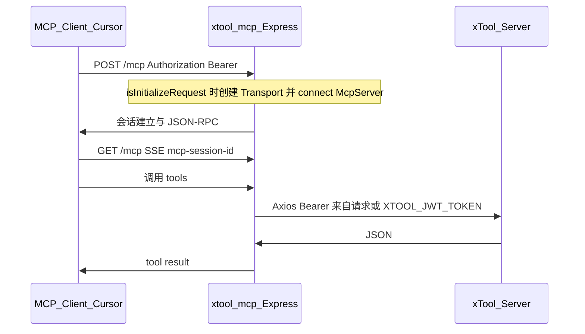

# xtool-mcp 远程 Streamable HTTP MCP 改造

## 背景与目标

- 当前实现：`[xtool-mcp/src/index.ts](xtool-mcp/src/index.ts)` 使用 `StdioServerTransport`，仅供 Cursor `command` 本地拉起。
- 目标：**仅运行可独立访问的 HTTP MCP 服务**（你已选择去掉 stdio），协议上与官方 SDK 推荐的 **Streamable HTTP** 一致，客户端通过 `**url` + 鉴权** 连接（形态接近高德等远端 MCP），**工具集与业务行为不变**。
- 技术依据：`@modelcontextprotocol/sdk@1.27` 已内置 **Streamable HTTP**、`createMcpExpressApp`、`StreamableHTTPServerTransport`；官方示例 `[simpleStreamableHttp.ts](https://github.com/modelcontextprotocol/typescript-sdk/blob/v1.x/src/examples/server/simpleStreamableHttp.ts)` 的 POST/GET/DELETE `/mcp` + 按 session 缓存 transport 的模式可直接对齐。

## 架构（部署后数据流）

## 实现要点

### 1. 入口与依赖

- `**[xtool-mcp/package.json](xtool-mcp/package.json)**`：增加 `**express**`、`**@types/express**`（运行时与类型）；`scripts.start` 仍为 `node dist/index.js`。
- `**[xtool-mcp/src/index.ts](xtool-mcp/src/index.ts)**`：改为 **只启动 HTTP 服务**（删除 `StdioServerTransport` 分支）。
- **控制监听**：通过环境变量配置，例如 `MCP_HTTP_PORT`（必选，无则退出并提示）、`MCP_HTTP_HOST`（默认 `0.0.0.0`）、`MCP_HTTP_PATH`（默认 `/mcp`）。与 `[createMcpExpressApp](https://unpkg.com/@modelcontextprotocol/sdk@1.27.0/dist/esm/server/express.js)` 的 `host` / `allowedHosts` 配合：公网部署时建议设置 `**allowedHosts`**（如反代域名列表），避免裸 `0.0.0.0` 无 Host 校验风险。

### 2. Streamable HTTP 路由（新模块，控制单文件行数）

拆分建议（满足仓库 400 行/文件惯例）：

- 新建 `[xtool-mcp/src/mcpServerFactory.ts](xtool-mcp/src/mcpServerFactory.ts)`：`createAppMcpServer()` 内 `new McpServer(...)` 并调用现有 `[registerAllTools](xtool-mcp/src/tools/index.ts)` —— **每个新会话创建一个 McpServer 实例**（与官方示例一致），避免会话间状态串线。
- 新建 `[xtool-mcp/src/streamableHttpApp.ts](xtool-mcp/src/streamableHttpApp.ts)` 或 `http/mcpRoutes.ts`：
  - `import { createMcpExpressApp } from '@modelcontextprotocol/sdk/server/express.js'`
  - `import { StreamableHTTPServerTransport } from '@modelcontextprotocol/sdk/server/streamableHttp.js'`
  - `import { isInitializeRequest } from '@modelcontextprotocol/sdk/types.js'`
  - `import { InMemoryEventStore } from '@modelcontextprotocol/sdk/examples/shared/inMemoryEventStore.js'`（若后续包路径不稳定，可改为把该类 **少量代码 vendoring** 到 `src/mcp/inMemoryEventStore.ts`）
  - 维护 `Record<sessionId, StreamableHTTPServerTransport>`，`onclose` 时删除；实现 **POST / GET / DELETE** 三种 handler（逻辑对齐官方示例 695–839 行附近）。
- **SIGINT**：关闭所有 transport 再退出（与示例一致）。

### 3. 请求级 Bearer 与 xTool API 客户端（功能不变、鉴权可多点登录）

当前 `[xtool-mcp/src/client/xtool-api.ts](xtool-mcp/src/client/xtool-api.ts)` 在进程级用 `config.jwtToken` 固定 Axios header，**无法支持多用户远端 MCP**。

- 新建 `**src/requestContext.ts`**：`AsyncLocalStorage<{ bearerToken: string }>`，在每条 HTTP 处理链路里 `run`。
- 修改 `**xtool-api.ts`**：
  - 有效 token：`effectiveToken = alsStore.bearerToken ?? config.jwtToken`（trim 后非空）。
  - **不要**长期使用单例 `AxiosInstance` 固定 Authorization；改为 **按请求** `axios.create({ baseURL, headers: { Authorization: Bearer effectiveToken }})`，或对实例在一次 `run` 内用拦截器覆盖 `Authorization`（避免跨请求串 token）。
  - `requireAuth()`：无 `effectiveToken` 时抛出与现有一致风格的错误（提示配置 env 或请求头 Bearer）。
- **认证中间件**：对 `MCP_HTTP_PATH` 下所有方法要求 `Authorization: Bearer …`；缺失返回 401 JSON-RPC 或 HTTP 401（与 SDK handler 期望一致即可）。

### 4. 工具注册策略（http-only）

当前 `[tools/index.ts](xtool-mcp/src/tools/index.ts)` 用 `hasAuth()` / `hasWebReader()` **在启动时**决定是否注册工具；远端场景下用户可能 **不带 env token、仅靠请求 Bearer**，会导致工具未注册。

- 调整为 **http-only 下始终注册** bookkeeping / todo / web（与「功能不变」一致：名称与 handler 不改）。
- `[getDifyApiKey](xtool-mcp/src/tools/web-reader.ts)` 内的 `hasAuth()` 需改为能识别 **请求级 token**（与第 3 步的 `hasAuth`/effective 一致），否则仅 env 有 token 时才能走 `/appkey/get/web_reader`。

可选：将「是否要求 env」的 `hasAuth()` 拆成 `**hasConfiguredEnvToken()`** 与 `**hasEffectiveAuth()`**，避免语义混淆（`config.ts` 小改即可）。

### 5. 配置与文档

- `**[xtool-mcp/.env.example](xtool-mcp/.env.example)`**：增加 `MCP_HTTP_PORT`、`MCP_HTTP_HOST`、`MCP_HTTP_PATH`；可选 `MCP_ALLOWED_HOSTS`（逗号分隔，映射到 `createMcpExpressApp({ allowedHosts })`）。
- `**[xtool-mcp/src/config.ts](xtool-mcp/src/config.ts)`**：读取上述变量并导出。
- `**[xtool-mcp/README.md](xtool-mcp/README.md)`** + 根目录 `**[README.md](README.md)`** MCP 小节：
  - Cursor 配置从 `command` 改为 `**url`**（具体 key 以 Cursor 当前 MCP 文档为准，一般为 `https://你的域名/mcp` + 请求带 Bearer）。
  - 部署说明：Node 进程、HTTPS 反代（Nginx/Caddy）、**务必公网加鉴权**（Bearer 即 mcp_key），不要用无鉴权裸奔。
- 大变更按项目规则同步 README（你已要求远端化，属大变更）。

### 6. 验证

- 本地：`MCP_HTTP_PORT=3333 XTOOL_SERVER_URL=…` 启动后，用官方示例 client 或 `curl`/MCP Inspector 对 **POST initialize** 与 **tool 调用** 做冒烟（需带 Bearer）。
- 确认记账/待办/网页阅读在「仅 Bearer、无 env token」与「仅 env token」两种情况下行为符合预期。

## 风险与说明

- **Cursor 兼容性**：需使用支持 **Streamable HTTP** 的 MCP 客户端版本；若某客户端只支持旧版纯 SSE URL，可后续再参考 SDK 示例 `sseAndStreamableHttpCompatibleServer.ts` 做兼容层（本次可不纳入首版，除非你需要）。
- **安全**：Bearer 即账号能力边界，生产环境必须 **HTTPS + 强密钥轮换**；建议反代层限流。

