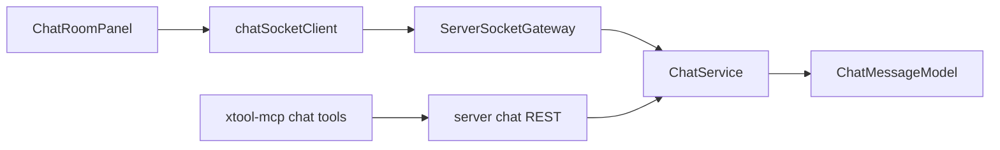

# 聊天室功能实施计划

## 目标与范围

- 新增“聊天室”菜单与页面，所有进入页面的用户可加入同一聊天室并实时收发消息。
- UI 满足左右分栏：本人消息在右侧，他人消息在左侧，包含头像/昵称与消息内容。
- 后端采用 Socket.IO 实现实时通讯。
- MCP 本次支持“文本发消息”，同时为“发图片”预留接口与消息结构。
- 模块解耦，增加结构化运行日志，便于后续维护与排障。

## 架构方案（已确认）

- 实时层：`Socket.IO`（server + renderer-client）。
- 聊天消息模型：统一 `parts` 结构（先落地 text，预留 image part）。
- MCP 聊天工具：先实现文本发送/查询，图片参数与上传引用字段先预留。

## 前端改造

- 在路由配置中注册聊天室页面，使菜单自动出现：
  - [routes.tsx](/Users/tangxixi/Desktop/knife/renderer/src/router/routes.tsx)
- 新增聊天室页面与解耦组件：
  - [ChatRoomPanel.tsx](/Users/tangxixi/Desktop/knife/renderer/src/page/chat-room/ChatRoomPanel.tsx)
  - [MessageList.tsx](/Users/tangxixi/Desktop/knife/renderer/src/components/chat/MessageList.tsx)
  - [MessageItem.tsx](/Users/tangxixi/Desktop/knife/renderer/src/components/chat/MessageItem.tsx)
  - [Composer.tsx](/Users/tangxixi/Desktop/knife/renderer/src/components/chat/Composer.tsx)
  - [chatSocket.ts](/Users/tangxixi/Desktop/knife/renderer/src/api/chatSocket.ts)
- 交互要求：
  - Enter 发送消息（符合项目输入框规则）。
  - 本人右侧、他人左侧；显示头像/昵称。
  - 自动滚动到底部、断线重连提示、发送失败提示（复用现有 toast）。

## 后端改造

- 新增聊天模块（路由 + service + model），与现有模块解耦：
  - [index.ts](/Users/tangxixi/Desktop/knife/server/src/index.ts)（挂载 chat 路由，创建 httpServer + socket server）
  - [chat.ts](/Users/tangxixi/Desktop/knife/server/src/routes/chat.ts)
  - [ChatMessage.ts](/Users/tangxixi/Desktop/knife/server/src/models/ChatMessage.ts)
  - [chatGateway.ts](/Users/tangxixi/Desktop/knife/server/src/realtime/chatGateway.ts)
  - [chatService.ts](/Users/tangxixi/Desktop/knife/server/src/service/chatService.ts)
- 认证复用：沿用 [auth.ts](/Users/tangxixi/Desktop/knife/server/src/middleware/auth.ts) 的 JWT/MCP Key 识别策略。
- 数据能力：
  - 拉取历史消息接口（分页）。
  - 发送消息 REST（供 MCP 使用）。
  - Socket 事件广播（join/send/message/new）。
- 运行日志：
  - 连接/断开、join、send、broadcast、错误都打印结构化日志（含 userId、username、roomId、messageId、traceId）。

## MCP 扩展

- 新增聊天工具实现与注册：
  - [chat.ts](/Users/tangxixi/Desktop/knife/xtool-mcp/src/tools/chat.ts)
  - [index.ts](/Users/tangxixi/Desktop/knife/xtool-mcp/src/tools/index.ts)
  - [xtool-api.ts](/Users/tangxixi/Desktop/knife/xtool-mcp/src/client/xtool-api.ts)
- 本次落地工具：
  - `chat/send_message`（文本）
  - `chat/list_messages`（查询最近消息）
- 图片预留：
  - MCP 入参与 server 消息结构预留 `attachments` / `parts.image` 字段；本次不打通上传。

## 数据与兼容性

- 新增聊天消息表（如 `chat_messages`），字段建议：`id`, `room_id`, `user_id`, `nickname`, `avatar`, `content_json(parts)`, `created_at`。
- 保持现有功能不受影响（菜单、待办、记账等模块只增不改核心行为）。

## 验证与回归

- 前端：双窗口互发，验证实时到达、左右布局、昵称头像展示、Enter 发送。
- 后端：Socket 连接稳定性、断线重连、历史消息分页。
- MCP：使用 `xtool-mcp` 发送文本消息并在聊天室实时可见。
- 日志：检查关键链路日志完整且可定位问题。
- 文档：更新 README（根 README 与 `xtool-mcp/README.md` 相关章节）。

