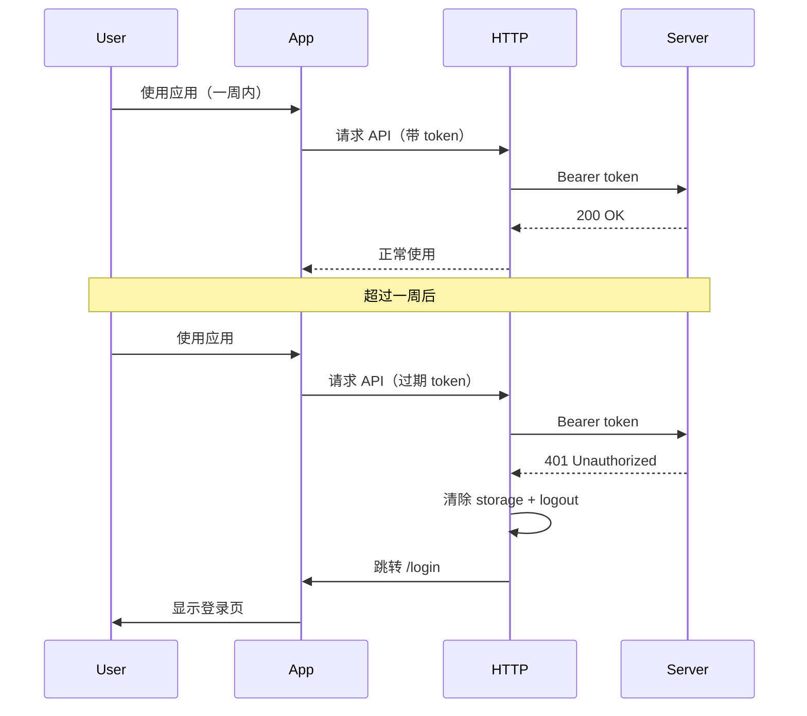

# 账号登录时间延长至一周（一周内免重新登录）

## 现状结论

- **服务端**：[server/src/utils/jwt.ts](server/src/utils/jwt.ts) 中 `generateToken()` 已使用 `expiresIn: '7d'`，即 JWT 有效期为 **7 天**。所有登录入口（账号密码、路人、验证码登录）均调用该函数，因此后端已满足「一周内免重新登录」。
- **前端**：Token 与用户信息保存在 `localStorage`（`xtool_token`、`xtool_user`），应用启动时在 [renderer/src/App.tsx](renderer/src/App.tsx) 的 `MainApp` 中恢复；若 `!user || !token` 则跳转 `/login`。前端**未**对接口返回的 401 做统一处理，token 过期后用户仍停留在主界面，仅会在请求时报错，体验不佳。

## 实现方案

### 1. 保持并明确服务端 7 天有效期（可选增强）

- **保持** [server/src/utils/jwt.ts](server/src/utils/jwt.ts) 中 `expiresIn: '7d'` 不变。
- 可选：将 `'7d'` 抽成常量（如 `JWT_EXPIRES_IN = '7d'`）或从环境变量读取，便于后续调整或文档化「登录有效期为 7 天」。

### 2. 前端：401 时统一登出并跳转登录（必做）

在 [renderer/src/utils/http.ts](renderer/src/utils/http.ts) 的 **响应拦截器** 中增加对 **401** 的处理：

- 当 `error.response?.status === 401` 时：
  - 清除本地登录态：`localStorage.removeItem('xtool_token')`、`localStorage.removeItem('xtool_user')`（可选一并清除 `xtool_shortcuts`、`xtool_appConfig`，或仅清除 token/user 以保证登出即可）。
  - 调用全局 store 的登出逻辑，将内存中的 `user`、`token` 置空（[renderer/src/store/useAppStore.ts](renderer/src/store/useAppStore.ts) 中已有 `logout`，可在拦截器里通过 `useAppStore.getState().logout()` 调用，避免在非 React 组件中直接使用 hook）。
  - 跳转登录页：使用 `window.location.pathname = '/login'` 或 `window.location.href = '/login'`（视当前路由 base 而定），或先清 storage 再 `window.location.reload()`，由应用启动时的 `if (!user || !token)` 自动跳转登录。

这样在「一周内」token 有效，请求正常；超过一周后 token 过期，任意带认证的请求会收到 401，触发上述逻辑，用户被清理登录态并回到登录页，实现「一周内免重新登录，过期后需重新登录」。

### 3. 避免重复跳转与误伤

- 若 401 发生在**登录接口**（如 `/auth/login`）或**登录页**发起的请求，则**不要**执行登出与跳转，仅 `reject(error)`，避免登录失败时被当成「过期」而清空或跳转。
- 判断方式：在拦截器中根据 `config.url` 或 `config.baseURL + config.url` 排除 `/auth/login`、`/auth/login-by-code`、`/auth/guest`、`/auth/send-code` 等登录相关路径，仅对其它接口的 401 做登出 + 跳转。

### 4. 文档与规范

- 按项目规则，在 [README.md](README.md) 中简要说明：登录态有效期为 7 天，7 天内免重新登录；超过 7 天需重新登录（可选补充：请求若返回 401 将自动跳转登录页）。

## 涉及文件

| 文件                                                                     | 变更                                                |
| ---------------------------------------------------------------------- | ------------------------------------------------- |
| [server/src/utils/jwt.ts](server/src/utils/jwt.ts)                     | 保持 `expiresIn: '7d'`；可选：常量/环境变量                   |
| [renderer/src/utils/http.ts](renderer/src/utils/http.ts)               | 响应拦截器：401 时排除登录相关 URL，再执行清除 storage、store 登出、跳转登录 |
| [renderer/src/store/useAppStore.ts](renderer/src/store/useAppStore.ts) | 无需改逻辑，仅被 http 拦截器调用 `getState().logout()`         |
| README.md                                                              | 补充登录有效期与 401 自动跳转的说明                              |

## 流程简述

以上即可在**不改变当前 7 天有效期**的前提下，完整实现「账号登录时间为一周、一周内免重新登录」，并在过期后通过 401 统一处理自动回到登录页。